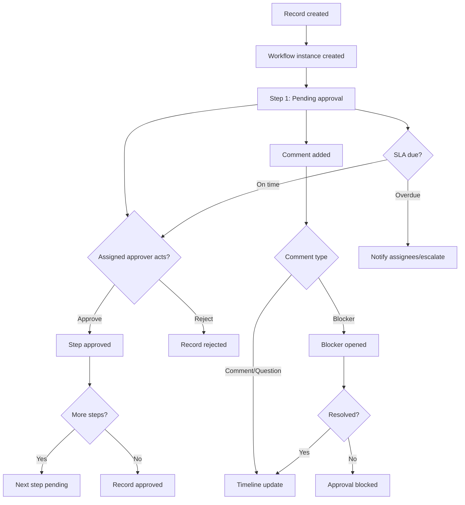

# Architecture: Approval Flow

Below is a high-level diagram for how approvals flow through Glue. The sequence focuses on the lifecycle from record creation to approval, including comments, blockers, and SLA reminders.

Key rules:
- Approvals are only allowed for assigned approvers on the current step.
- Unresolved blocker comments prevent approval.
- SLA checks send notifications and optionally escalate assignees.
